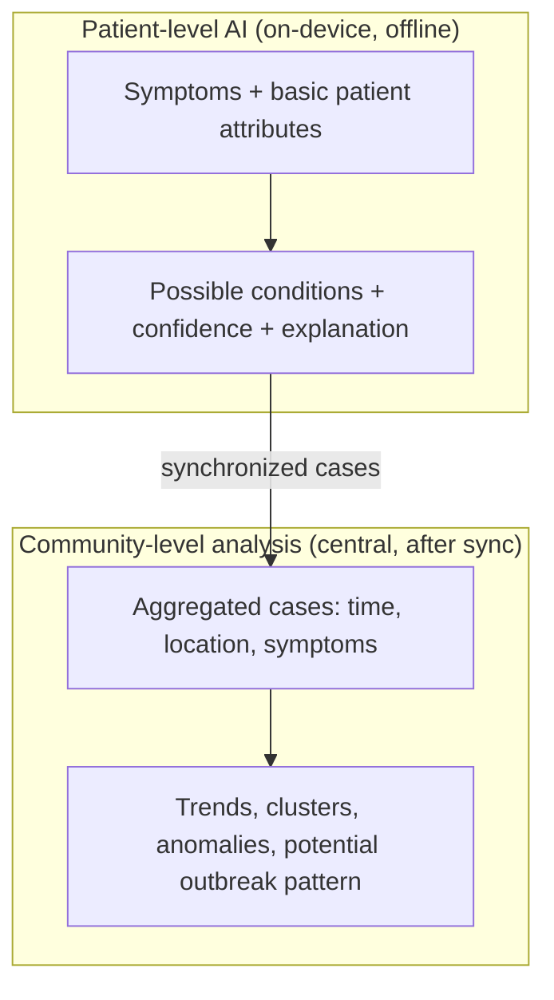
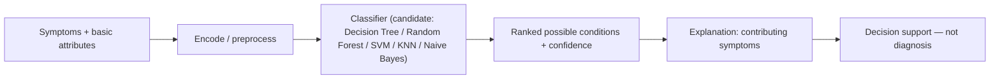
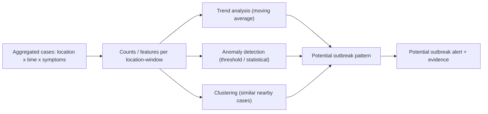

# GramCare — AI Methodology

> **Project:** GramCare — AI-Powered Offline Disease Outbreak Monitoring System
> **Document:** AI Methodology (problem definition and candidate-approach comparison)
> **Version:** 0.1 (Review 1 — Research & System Design)
> **Status:** Baseline — model not yet finalized
> **Last updated:** 2026-08-22
> **Team:** M. Faizan Patel · Yasa Ghanchi · Niranjan Mohite · Yash S. Waghela
> **Guide / College:** *To be finalized*

---

## 1. Purpose and boundaries

This document defines GramCare's AI work as two distinct problems and compares candidate approaches for each. It does **not** finalize a model. Consistent with decisions D-006 and D-007 and open items O-04 and O-09, the choice of symptom classifier and outbreak-detection method stays open until the evidence in `DATASET_STRATEGY.md` and `TESTING_STRATEGY.md` supports one. The two problems are deliberately kept separate because they have different inputs, outputs, data needs, and places of execution.

Two boundaries carry over from `AI_REQUIREMENTS.md` and govern everything below. First, all patient-level output is **decision support, not diagnosis** (D-007): the system proposes *possible conditions* for professional judgement and never issues a definitive diagnosis. Second, all community-level output describes a **potential** pattern that warrants investigation — never a confirmed outbreak. These are not disclaimers bolted on at the end; they shape what the models are allowed to output and how confidence and explanations are presented.

## 2. Patient-level AI

**Task type.** Supervised multi-class classification (a record's symptoms map to one or more ranked possible conditions). This framing matches the symptom-based prediction and ML disease-classification literature reviewed in `LITERATURE_REVIEW.md` (papers 1 and 2).

**Input.** The recorded symptoms for an encounter (primarily categorical presence/absence) plus relevant basic patient attributes (for example age and gender). No free-text or imaging input is in scope for the MVP.

**Output.** One or more *possible conditions*, each with a confidence or rank (FR-AI-02) and a human-readable reason — typically the symptoms that most influenced the suggestion (FR-AI-03, NFR-07). The output is explicitly framed as a possible condition for professional judgement (FR-AI-04).

**Where it runs.** On-device, so it works with zero connectivity (FR-AI-05, NFR-01). This is a hard constraint: a model that cannot run offline on a modest device does not meet the requirement, regardless of its accuracy. The survey notes that offline on-device inference is largely an engineering concern with little direct literature precedent, so the model must be chosen with its deployed footprint in mind, not only its benchmark accuracy.

## 3. Community-level analysis

**Task type.** Unsupervised and statistical analysis over aggregated cases: trend detection, spatial/temporal grouping, and anomaly flagging. There is no labelled "outbreak/no-outbreak" ground truth in a synthetic prototype, so this is not framed as supervised classification.

**Input.** Synchronized cases aggregated by time and location, with their symptoms / possible conditions (see `DATA_MODEL.md`: `Case`, `CaseCluster`, `Location`).

**Output.** Case-count trends over successive periods (FR-CA-02), location summaries and hotspots (FR-CA-03, FR-DB-04), candidate clusters of similar nearby cases (FR-CA-04), anomalies, and a **potential outbreak pattern** with its supporting evidence (FR-CA-05/06). Every flag carries the contributing cases, location(s), and time window that produced it.

**Where it runs.** Centrally, after synchronization — it does not need to run offline on the device. This relaxes the footprint constraint that binds the patient-level model, but D-006 still favours a simple, explainable method over a complex epidemiological model.

## 4. Candidate approaches — symptom classification

The candidates below are all comparatively lightweight and interpretable, which suits an offline device, a short timeline, and the explainability requirement. Deep learning is treated as out of scope for the MVP (see §4.2).

### 4.1 Comparison

| Approach | Explainability | Data requirements | Computational cost | Offline / mobile suitability | 3–4 month FYP suitability | Key advantage | Key disadvantage |
|----------|----------------|-------------------|--------------------|------------------------------|---------------------------|---------------|------------------|
| **Decision Tree** | Very high — the path is a readable rule | Low | Very low (train and infer) | Excellent — tiny model | Excellent | Transparent, fast, trivially explainable | Can overfit; a single tree is often less accurate alone |
| **Random Forest** | Medium — feature importance, but the ensemble is less directly readable | Low–medium | Low–medium | Good — larger but still modest | Very good — strong, robust baseline | Robust accuracy, handles noisy features | Bigger model; less directly interpretable than one tree |
| **SVM** | Low–medium — margins are not intuitive (a linear kernel gives feature weights) | Medium — needs scaling and tuning | Medium to train; light to infer | Good — small once trained | Good — strong on small structured data (evidence: paper 2) | Effective on small, structured datasets | Kernel/parameter tuning; multi-class needs a strategy |
| **KNN** | Medium — nearest neighbours are inspectable | Low to train, but stores the dataset | Inference cost grows with dataset size | Fair — must ship the dataset; inference latency risk | Fair — quick baseline | Simple; no training; example-based explanation | Memory and latency at inference; sensitive to scaling and irrelevant features |
| **Naive Bayes** | High — per-symptom probabilistic contributions | Very low — works with little data | Very low | Excellent — tiny | Excellent — natural fit for symptom presence/absence | Fast, small, gives probability-style confidence | Feature-independence assumption is unrealistic (symptoms correlate), which can miscalibrate confidence |

### 4.2 Deep learning (deferred, with reason)

Neural approaches (including the CNN-LSTM and knowledge-graph + deep-learning models in papers 4 and 5) are deferred for the patient-level MVP. They are data-hungry relative to a small synthetic dataset, are heavier to run on-device, and are harder to explain — all three cut against NFR-07, FR-AI-05, and the timeline. This is a scope decision, not a claim that they are ineffective; it can be revisited if a suitable dataset and clear explainability path appear.

## 5. Candidate approaches — outbreak detection

Per D-006, the candidates favour simple, explainable detection over complex epidemiological deep learning. The reviewed spatio-temporal anomaly-detection work (paper 3) is directly relevant but uses a heavy deep model on a large real dataset; GramCare adopts its *idea* (flagging unusual increases across time and space) using lighter methods appropriate to demo-scale synthetic data.

### 5.1 Comparison

| Approach | Explainability | Data requirements | Computational cost | Offline / on-device relevance | 3–4 month FYP suitability | Key advantage | Key disadvantage |
|----------|----------------|-------------------|--------------------|-------------------------------|---------------------------|---------------|------------------|
| **Fixed / relative threshold** | Very high | Minimal — current counts | Trivial | Runs centrally; trivial either way | Excellent | Dead simple, transparent, easy to demo | Crude; a fixed threshold ignores context and can over- or under-fire |
| **Moving average (+ deviation)** | High — "above recent baseline" is intuitive | Short history per location | Trivial | Central | Excellent | Adapts to each location's baseline; smooths noise; natural fit for "rising trend" | Lag; needs enough history; window length must be chosen |
| **Statistical anomaly detection** (z-score, EWMA, CUSUM, Poisson) | Medium–high — an anomaly score against a threshold | A baseline distribution per location | Low | Central | Good | Principled; gives a tunable anomaly score; EWMA/CUSUM catch early rises | Small case counts break the normal assumption (Poisson/count models fit better); needs tuning |
| **Lightweight clustering** (k-means, DBSCAN) | Medium — clusters are interpretable via their members | Enough cases; encode symptoms + location + time | Low–medium | Central | Good — directly supports the clustering requirement (FR-CA-04) | Groups similar nearby cases; DBSCAN finds dense spatio-temporal groups without a preset count | Parameter sensitivity (k, eps); mixed-feature scaling; unstable on very small data |

### 5.2 A combination is likely, not a single method

These are complementary rather than mutually exclusive. FR-CA-05 defines a potential outbreak by the *combination* of rising counts, symptom similarity, and spatial/temporal proximity — which maps naturally onto a trend method (moving average) **and** a grouping method (clustering) **and** a flag (threshold or statistical). The MVP is therefore likely to compose two or three simple methods rather than pick one, keeping each part explainable.

## 6. Explainability approach

Explainability is a requirement (NFR-07), not a nice-to-have, and it is a criterion in choosing between the candidates above. At the patient level, the system surfaces the symptoms that most influenced each possible condition — natural for a decision tree (the rule path), Naive Bayes (per-symptom probabilities), or feature importance from a random forest. At the community level, every potential-outbreak flag ships with its evidence: the contributing cases, the location(s), the time window, and the dominant symptoms (FR-CA-06, and the `Alert.supporting_evidence` field in `DATA_MODEL.md`). In both layers the explanation is what lets a human exercise the judgement that D-007 reserves for them.

## 7. What the literature leans toward (not a final choice)

The reviewed papers (see `LITERATURE_REVIEW.md`) lean in consistent directions without dictating a single model:

- **Symptom classification → explainable classical ML.** Paper 1 emphasises explainable ML for symptom-based prediction; paper 2 found classical models (with SVM performing best) effective on a small structured clinical dataset. This supports starting from explainable classical models (for example Decision Tree, Naive Bayes, or Random Forest) and benchmarking rather than reaching for deep learning.
- **Outbreak detection → lightweight unsupervised / statistical.** Paper 3 establishes spatio-temporal anomaly detection for early outbreak signals; GramCare keeps the concept but uses simpler threshold/moving-average/clustering methods suited to synthetic demo data (D-006).
- **Graph methods → evaluate, do not assume.** Papers 5 and 6 show graph and GNN approaches are viable for health-relationship modelling, but they add data and implementation complexity; consistent with D-005 the MVP is built without a graph store and graph value is evaluated separately (O-08).
- **Offline on-device inference → an engineering problem.** The survey found little direct precedent, reinforcing that the patient-level model must be chosen for its deployed footprint, not only benchmark accuracy.

## 8. Decision status and selection criteria

**Not finalized.** No classifier and no detection algorithm is selected in this document. O-04 (AI model) and O-09 (outbreak-detection algorithm) remain open in `DECISIONS.md`.

When the choice is made, it will be judged against these criteria, in roughly this priority for the MVP: explainability (NFR-07), offline/on-device footprint for the patient-level model (FR-AI-05, NFR-01), adequate accuracy on the synthetic dataset, and implementation effort within the timeline (D-011). The leaning in §7 is evidence-based but provisional; the final selection will be confirmed empirically and recorded as new decision entries, with the evaluation method defined in `TESTING_STRATEGY.md` and the data in `DATASET_STRATEGY.md`.

---

### Related documents

- [Project Overview](./PROJECT_OVERVIEW.md)
- [MVP Scope](./MVP_SCOPE.md)
- [Architecture](./ARCHITECTURE.md)
- [AI Requirements](./AI_REQUIREMENTS.md)
- [Requirements Specification](./REQUIREMENTS.md)
- [Data Model](./DATA_MODEL.md)
- [AI Methodology](./AI_METHODOLOGY.md) *(this document)*
- [Dataset Strategy](./DATASET_STRATEGY.md)
- [Demo Scenario](./DEMO_SCENARIO.md)
- [Testing Strategy](./TESTING_STRATEGY.md)
- [Decisions Log](./DECISIONS.md)
- [Literature Review](./LITERATURE_REVIEW.md)
