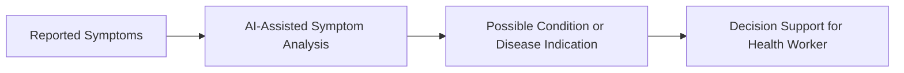
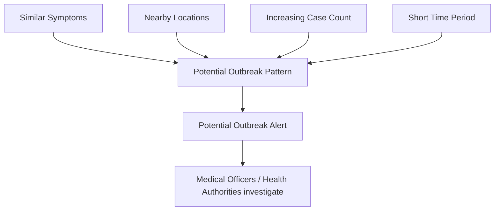

# GramCare — AI Requirements and Boundaries

> **Project:** GramCare — AI-Powered Offline Disease Outbreak Monitoring System
> **Document:** AI Requirements and Boundaries
> **Version:** 0.1 (Review 1 — Research & System Design)
> **Status:** Baseline
> **Last updated:** 2026-08-22
> **Team:** M. Faizan Patel · Yasa Ghanchi · Niranjan Mohite · Yash S. Waghela
> **Guide / College:** *To be finalized*

---

## 1. Role of AI in GramCare

AI is one component of GramCare, not the entire project. GramCare is a system for offline data collection, synchronization, community-level analysis, and visualization; AI contributes decision support within that system. Framing AI this way keeps expectations realistic and keeps the project's value from depending on a single model performing perfectly.

## 2. Symptom analysis

The most direct use of AI is symptom analysis at the point of care. The health worker records the reported symptoms, and the system returns a possible condition or disease indication. This output is explicitly **decision support** for the health worker — an aid to judgement, not a verdict.

## 3. Analytical methods for community-level monitoring

Beyond individual symptom analysis, AI and analytical methods support monitoring across the aggregated data. The intended capabilities are pattern detection across locations and time, anomaly detection to flag unusual increases, case clustering to group similar nearby cases, and disease-trend analysis over successive periods. These correspond to the time, location, and cluster dimensions described in `PROJECT_OVERVIEW.md`.

## 4. Potential outbreak pattern logic

GramCare does not try to prove that an outbreak is occurring. It looks for a *combination* of signals that together suggest a pattern worth investigating: similar symptoms, nearby locations, an increasing case count, and a short time period. When these coincide, the system raises a potential outbreak alert for authorities to investigate.

For the MVP, a simple threshold or anomaly-based method is expected to be more appropriate than a complex deep-learning epidemiological model. The specific detection algorithm is not finalized and is tracked in `DECISIONS.md`.

## 5. Medical boundary

This boundary is a firm requirement of the project and applies to every description, demonstration, and document.

GramCare **does not**:

- replace doctors;
- provide a definitive clinical diagnosis;
- confirm an outbreak automatically;
- make autonomous medical decisions.

GramCare **provides**:

- AI-assisted analysis;
- possible-condition predictions;
- disease-pattern insights;
- potential outbreak alerts;
- decision-support information.

The final decision always remains with medical officers and health authorities.

## 6. Language and framing rules

To keep the project accurate and defensible, GramCare is consistently described as **AI-assisted**, never as an "AI doctor." It generates **potential** outbreak alerts, never "confirmed" outbreak notifications. It provides **decision support**, not autonomous medical decisions. For the college prototype it uses **synthetic or demo data** rather than implying clinical deployment. These framing rules are not merely stylistic; they define what the system is permitted to claim.

## 7. Model and data status

The exact machine-learning model, the training approach, and the dataset are **not finalized**. Model selection will follow the development philosophy in `MVP_SCOPE.md` — favouring the simplest approach that is working, testable, and explainable over a more complex approach that is harder to complete and justify within the project timeline. Data-handling for the prototype is described in `MVP_SCOPE.md` (synthetic/demo data only).

---

### Related documents

- [Project Overview](./PROJECT_OVERVIEW.md)
- [MVP Scope](./MVP_SCOPE.md)
- [Architecture](./ARCHITECTURE.md)
- [AI Requirements](./AI_REQUIREMENTS.md) *(this document)*
- [Requirements Specification](./REQUIREMENTS.md)
- [Data Model](./DATA_MODEL.md)
- [AI Methodology](./AI_METHODOLOGY.md)
- [Dataset Strategy](./DATASET_STRATEGY.md)
- [Demo Scenario](./DEMO_SCENARIO.md)
- [Testing Strategy](./TESTING_STRATEGY.md)
- [Decisions Log](./DECISIONS.md)
- [Literature Review](./LITERATURE_REVIEW.md)
