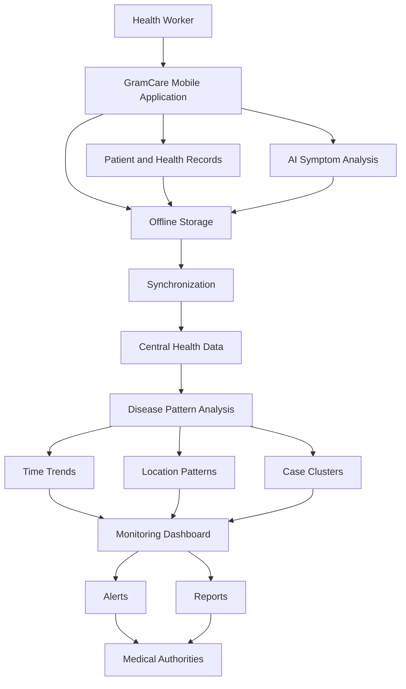
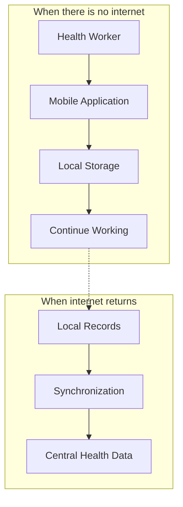
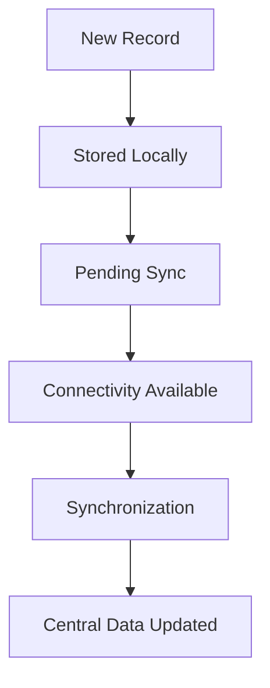

# GramCare — Architecture

> **Project:** GramCare — AI-Powered Offline Disease Outbreak Monitoring System
> **Document:** System Architecture (Conceptual)
> **Version:** 0.1 (Review 1 — Research & System Design)
> **Status:** Technology-neutral baseline
> **Last updated:** 2026-08-22
> **Team:** M. Faizan Patel · Yasa Ghanchi · Niranjan Mohite · Yash S. Waghela
> **Guide / College:** *To be finalized*

---

## 1. Architecture principle

At the current stage the architecture is described in terms of *responsibilities and data flow*, not specific products or vendors. This is a deliberate decision: locking the design to particular frameworks, databases, or cloud providers before the requirements are fully understood would constrain the project prematurely. The concrete technology stack will be selected later, and the reasoning is recorded in `DECISIONS.md`. The primary user-facing component is the **health-worker mobile application**; every other component exists to support the flow of data from that application to the people who act on it.

## 2. Conceptual architecture

## 3. Components and responsibilities

The **mobile application** is the field interface used by health workers. It handles patient registration, symptom entry, local persistence, and on-device AI-assisted symptom analysis, and it must remain fully usable without connectivity.

**Patient and health records** are the structured data captured in the field — patient identity, symptoms, and associated metadata such as location and time.

**AI symptom analysis** runs at the point of care to provide decision support to the health worker. Its role and boundaries are defined in `AI_REQUIREMENTS.md`.

**Offline storage** holds records and analysis results on the device so that work continues uninterrupted when there is no network.

**Synchronization** transfers locally-held records to the central store when connectivity is available.

**Central health data** is the aggregated store across all locations, and it is the foundation for community-level analysis.

**Disease pattern analysis** examines the aggregated data along three dimensions — time trends, location patterns, and case clusters.

The **monitoring dashboard** presents these results to medical officers and health authorities and is the surface on which alerts and reports appear.

## 4. Offline-first operation

Offline operation is a core concept of GramCare, not an optional feature. The application is designed so that the absence of a network never blocks data collection. When there is no internet, the health worker keeps working against local storage; when connectivity returns, locally-held records are synchronized to the central store.

## 5. Synchronization

Synchronization is currently a conceptual process. A new record is stored locally and marked as pending; when connectivity becomes available the pending records are synchronized and the central store is updated.

The specific synchronization technology and the conflict-resolution strategy (for example, how to reconcile edits made to the same record on different devices) are **not finalized**. These are tracked as open items in `DECISIONS.md`.

## 6. Geographic analysis

Geographic analysis is part of the proposed concept. The system may use location information at varying granularity — village, area, district, and, where appropriate, geographic coordinates. The purpose is to understand where cases are occurring and to identify areas showing unusual concentrations. The exact geographic information system (GIS) approach and mapping technology are **not finalized**.

## 7. Monitoring dashboard

The dashboard is intended for medical officers and health authorities rather than being the primary field interface. It is expected to present disease trends (case counts over time), an area overview (cases by village or area), potential hotspots (locations with unusual concentrations), alerts (patterns requiring investigation), and reports (summaries and statistics). The detailed user-interface design is **not finalized**.

## 8. Potential outbreak detection

GramCare does not attempt to mathematically prove that an outbreak is occurring. Its goal is to detect *potential* abnormal disease patterns — for example, similar symptoms across nearby locations with an increasing case count over a short time period — and surface them for investigation. The detailed detection logic is defined in `AI_REQUIREMENTS.md`. For the MVP, a simple threshold or anomaly-based approach is expected to be more appropriate than a complex deep-learning epidemiological model; the specific algorithm is **not finalized**.

## 9. Graph analysis (evaluated, not committed)

Graph technology was considered because health data naturally contains relationships — a patient relates to symptoms, symptoms relate to a possible disease, and cases relate to location and time. Graph-based analysis is **not mandatory for the MVP**. The team will first evaluate whether it adds meaningful value over simpler approaches before adopting it. In particular, a graph database such as Neo4j will not be adopted merely because it is technically sophisticated; the literature indicates that graph-based approaches can introduce additional data and implementation complexity, which must be justified against the project's objectives and timeline.

## 10. Technologies deliberately not committed yet

To keep the architecture honest at this stage, the following are explicitly **not** part of the design and should not be presented as chosen:

- Cloud providers: AWS, Azure, Google Cloud
- Databases: PostgreSQL, Neo4j, vector databases
- Front-end / app frameworks: React, Flutter
- Back-end frameworks: FastAPI
- ML frameworks: TensorFlow, TensorFlow Lite
- Architectural patterns and AI constructs: API Gateway, microservices, LLM, RAG, AI agents

An earlier automated architecture generator produced a design built around a generic web application, API gateway, RAG orchestrator, LLM server, and vector database. That output was **rejected** because it does not represent the GramCare concept: the primary user-facing component is the health-worker mobile application, not a web application, and the project does not currently require an LLM/RAG stack. The rationale is recorded in `DECISIONS.md`.

---

### Related documents

- [Project Overview](./PROJECT_OVERVIEW.md)
- [MVP Scope](./MVP_SCOPE.md)
- [Architecture](./ARCHITECTURE.md) *(this document)*
- [AI Requirements](./AI_REQUIREMENTS.md)
- [Requirements Specification](./REQUIREMENTS.md)
- [Data Model](./DATA_MODEL.md)
- [AI Methodology](./AI_METHODOLOGY.md)
- [Dataset Strategy](./DATASET_STRATEGY.md)
- [Demo Scenario](./DEMO_SCENARIO.md)
- [Testing Strategy](./TESTING_STRATEGY.md)
- [Decisions Log](./DECISIONS.md)
- [Literature Review](./LITERATURE_REVIEW.md)
