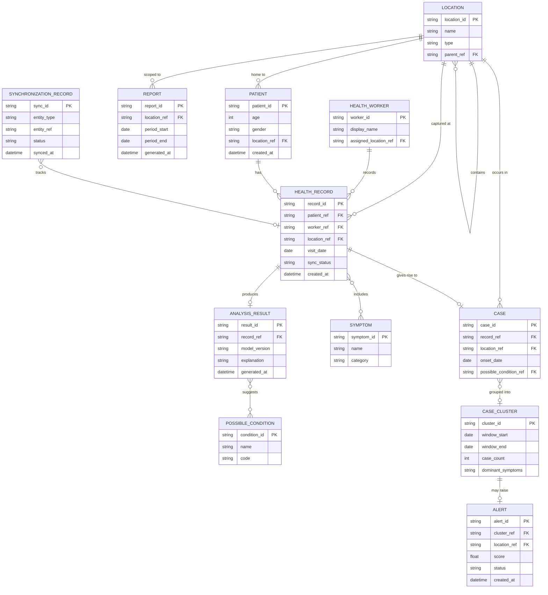

# GramCare — Conceptual Data Model

> **Project:** GramCare — AI-Powered Offline Disease Outbreak Monitoring System
> **Document:** Conceptual Data Model (database-neutral)
> **Version:** 0.1 (Review 1 — Research & System Design)
> **Status:** Baseline
> **Last updated:** 2026-08-22
> **Team:** M. Faizan Patel · Yasa Ghanchi · Niranjan Mohite · Yash S. Waghela
> **Guide / College:** *To be finalized*

---

## 1. Purpose and neutrality

This document defines GramCare's information in terms of **entities, fields, and relationships** — not tables, collections, or a specific database engine. It is deliberately database-neutral, consistent with decision D-001 and open decision O-02: no choice is made here among relational, document, or graph stores, and a graph representation remains optional pending the evaluation in D-005. Field names are conceptual; concrete types, indexes, and keys are implementation decisions made later. The model supports the requirements in `REQUIREMENTS.md` and the analysis flow in `AI_METHODOLOGY.md`.

## 2. Entity relationship overview

## 3. Entities

### 3.1 Patient
**Purpose:** A person receiving care, identified pseudonymously (no real identity in the prototype, per D-008/NFR-05).
**Key fields:** `patient_id` (pseudonymous), `age`, `gender`, `location_ref`, `created_at`.
**Relationships:** Belongs to one `Location`; has many `HealthRecord`s.

### 3.2 HealthRecord
**Purpose:** A single field encounter/visit — the raw unit captured by a health worker. This is the offline-first write target.
**Key fields:** `record_id`, `patient_ref`, `worker_ref`, `location_ref`, `visit_date`, `symptoms` (set of `Symptom` references), `analysis_result_ref`, `sync_status` (pending/synced/failed), `created_at`, `updated_at`.
**Relationships:** Belongs to one `Patient`; created by one `HealthWorker`; includes many `Symptom`s; produces at most one patient-level `AnalysisResult`; gives rise to one `Case`.

### 3.3 Symptom
**Purpose:** A controlled symptom concept, so entries are comparable across records and workers (needed for clustering and similarity).
**Key fields:** `symptom_id`, `name`, `code` (optional), `category` (optional).
**Relationships:** Appears in many `HealthRecord`s (many-to-many).

### 3.4 PossibleCondition
**Purpose:** A candidate condition the AI can suggest. Named "possible condition" deliberately — never "diagnosis" (D-007, FR-AI-04).
**Key fields:** `condition_id`, `name`, `code` (optional), `description` (optional).
**Relationships:** Referenced by `AnalysisResult` suggestions (many-to-many).

### 3.5 AnalysisResult
**Purpose:** The patient-level AI output for one `HealthRecord`: the ranked possible conditions, their confidence, and a human-readable explanation (FR-AI-01…03, NFR-07).
**Key fields:** `result_id`, `record_ref`, `model_version`, `generated_at`, `suggestions` (list of `{possible_condition_ref, confidence}`), `explanation`.
**Relationships:** Belongs to one `HealthRecord`; references one or more `PossibleCondition`s. Carries no authority to act — it is decision support only.

### 3.6 Case
**Purpose:** The normalised epidemiological unit used for community analysis, derived from a `HealthRecord`. Keeping `Case` separate from `HealthRecord` decouples analysis from raw field data and from sync concerns; typically one case per record.
**Key fields:** `case_id`, `record_ref`, `location_ref`, `onset_date` (or visit date), `primary_symptoms`, `possible_condition_ref`, `status`.
**Relationships:** Derived from one `HealthRecord`; occurs in one `Location`; may belong to one `CaseCluster`.

### 3.7 CaseCluster
**Purpose:** A group of similar, nearby cases identified by the community-level analysis (FR-CA-04) — the building block for a potential outbreak flag.
**Key fields:** `cluster_id`, `window_start`, `window_end`, `location_scope` (one or more `Location` refs), `dominant_symptoms`, `case_count`, `similarity_basis`, `created_at`.
**Relationships:** Groups many `Case`s; may raise one `Alert`.

### 3.8 AnalysisResult vs. community outputs (note)
Trends and anomalies from the community layer (FR-CA-02/03/05) are computed views over `Case`s, `CaseCluster`s, and time/location — they are represented as `CaseCluster`, `Alert`, and `Report` rather than as separate stored rows per trend. This keeps the model lean while still covering "trends, clusters, anomalies, potential outbreak pattern."

### 3.9 Alert
**Purpose:** A *potential* outbreak alert raised for investigation (FR-CA-05/06, FR-AU-01). It is always "potential," never a confirmed outbreak (D-007).
**Key fields:** `alert_id`, `cluster_ref` (or detection criteria), `location_ref`, `time_window`, `score`/`severity`, `supporting_evidence` (contributing cases, locations, window), `status` (new/under_review/acknowledged/closed), `created_at`, `reviewed_by`, `reviewed_at`.
**Relationships:** Raised from a `CaseCluster` (or a detection over `Case`s); reviewed by an oversight user (see §4).

### 3.10 Report
**Purpose:** A generated summary of activity for a location scope and period (FR-DB-06, FR-AU-02).
**Key fields:** `report_id`, `location_ref` (scope), `period_start`, `period_end`, `generated_at`, `metrics` (counts, trends), `format`.
**Relationships:** Summarises `Case`s/`CaseCluster`s/`Alert`s for a scope and period.

### 3.11 HealthWorker
**Purpose:** The field user who creates records and triggers synchronization (FR-HW-*).
**Key fields:** `worker_id`, `display_name` (or pseudonym), `assigned_location_ref`, `role`.
**Relationships:** Records many `HealthRecord`s; associated with a `Location`.

### 3.12 Location
**Purpose:** A place at variable granularity (village / area / district), optionally with coordinates, enabling location patterns and hotspots (FR-CA-03, FR-DB-03/04).
**Key fields:** `location_id`, `name`, `type` (village/area/district), `parent_ref` (hierarchy), `latitude` (optional), `longitude` (optional).
**Relationships:** Self-referential hierarchy (`parent_ref`); referenced by `Patient`, `HealthRecord`, `Case`, `Alert`, `Report`, `HealthWorker`.

### 3.13 SynchronizationRecord
**Purpose:** Tracks the offline-to-central synchronization state of a syncable entity (FR-HW-06, NFR-02/03).
**Key fields:** `sync_id`, `entity_type`, `entity_ref`, `device_id`, `local_created_at`, `synced_at`, `status` (pending/in_progress/synced/failed), `conflict_flag`, `attempt_count`.
**Relationships:** References one syncable entity (primarily `HealthRecord`, generalisable to `Patient` and others).

## 4. Notes on identity, sync, and privacy

**Oversight user.** `Alert.reviewed_by` and report review (FR-AU-*) imply a medical-officer/authority user. It is intentionally not expanded into a full entity here to keep to the requested core set; it can be added as a `User` entity (with role = worker/officer) when access control is designed.

**Identifiers.** All identifiers are opaque and pseudonymous. Because the prototype uses synthetic data (D-008), no field carries real personal health information; the model must remain valid under pseudonymisation (NFR-05).

**Sync status and conflicts.** `sync_status` on `HealthRecord` plus the `SynchronizationRecord` log together satisfy data-consistency requirements (NFR-03). The conflict-resolution rule itself is an open decision (O-07) and is not fixed here.

**No database chosen.** This model does not select PostgreSQL, SQLite, Firebase, MongoDB, Neo4j, or any other store. Whether relationships are realised as foreign keys, embedded documents, or graph edges is deferred to O-02/O-08.

---

### Related documents

- [Project Overview](./PROJECT_OVERVIEW.md)
- [MVP Scope](./MVP_SCOPE.md)
- [Architecture](./ARCHITECTURE.md)
- [AI Requirements](./AI_REQUIREMENTS.md)
- [Requirements Specification](./REQUIREMENTS.md)
- [Data Model](./DATA_MODEL.md) *(this document)*
- [AI Methodology](./AI_METHODOLOGY.md)
- [Dataset Strategy](./DATASET_STRATEGY.md)
- [Demo Scenario](./DEMO_SCENARIO.md)
- [Testing Strategy](./TESTING_STRATEGY.md)
- [Decisions Log](./DECISIONS.md)
- [Literature Review](./LITERATURE_REVIEW.md)
