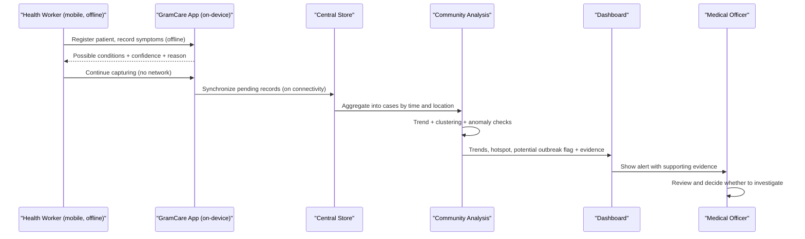

# GramCare — Demo Scenario

> **Project:** GramCare — AI-Powered Offline Disease Outbreak Monitoring System
> **Document:** Demonstration Scenario (end-to-end walkthrough)
> **Version:** 0.1 (Review 1 — Research & System Design)
> **Status:** Baseline
> **Last updated:** 2026-08-22
> **Team:** M. Faizan Patel · Yasa Ghanchi · Niranjan Mohite · Yash S. Waghela
> **Guide / College:** *To be finalized*

---

> **Integrity note.** Everything below runs on **DEMO / SIMULATED DATA** (D-008). The scenario is engineered to exercise the system's logic end to end; it is **not** a claim of real-world outbreak prediction, and every AI output is decision support, not diagnosis (D-007).

## 1. Purpose

This document is the script for demonstrating GramCare's complete flow — from a health worker capturing data offline to a medical officer reviewing a *potential* outbreak alert. It ties each step to the requirements in `REQUIREMENTS.md` so the demonstration visibly proves the success chain: Problem → Requirements → … → MVP → Demo → Testing. It reuses the exact figures fixed in `PROJECT_OVERVIEW.md` and `MVP_SCOPE.md` and generated per `DATASET_STRATEGY.md`, so no number here is new.

## 2. Scenario setup

Four villages report over three weeks. Most report normal background activity; one shows a sudden increase, and a neighbouring one reports similar symptoms — the combination the community layer is designed to notice.

| Location | Cases (snapshot) | Role in the demo |
|---|---|---|
| Village A | 3 | Normal background |
| Village B | 4 | Normal background |
| Village C | 18 | Sudden increase |
| Village D | *similar symptoms* | Symptom-similarity cluster near C |

| Week | Cases (rising-trend location) |
|---|---|
| Week 1 | 5 |
| Week 2 | 7 |
| Week 3 | 15 |

The two actors are a **health worker** (field, mobile app, mostly offline) and a **medical officer** (oversight, dashboard). The data is synthetic and labelled **DEMO / SIMULATED DATA**.

## 3. End-to-end walkthrough

### Act 1 — Offline field capture (`FR-HW-01…05`, `NFR-01`)
With the device in airplane mode, the health worker registers patients and records their symptoms and visit dates in Villages A–D. Everything saves locally and remains browsable; nothing depends on the network. *Expected behaviour:* records persist offline and are marked **pending** sync.

### Act 2 — On-device AI decision support (`FR-AI-01…05`, `NFR-07`)
As each encounter is recorded, the app shows one or more **possible conditions**, a confidence/rank, and a short reason (the symptoms that most influenced the suggestion). *Expected behaviour:* results appear at the point of care, still offline, each clearly framed as a *possible condition for professional judgement* — never a diagnosis.

### Act 3 — Synchronization (`FR-HW-06`, `NFR-02/03`)
Connectivity is restored. Pending records synchronise to the central store, and the worker sees their status change to **synced**. *Expected behaviour:* no record is lost or duplicated; an interrupted sync resumes cleanly.

### Act 4 — Community-level analysis (`FR-CA-01…06`)
Centrally, synchronised encounters are aggregated into cases by time and location. The analysis computes the weekly trend (5 → 7 → 15), summarises cases per village (A 3, B 4, C 18), and groups similar nearby cases (C with D) into a candidate cluster. Because rising counts, symptom similarity, and spatial/temporal proximity coincide, it raises a **potential outbreak pattern** carrying its supporting evidence. *Expected behaviour:* Villages A and B stay quiet; C is flagged; the flag lists the contributing cases, location(s), and time window.

### Act 5 — Dashboard and potential alert (`FR-DB-01…06`)
The officer's dashboard shows the case overview, the upward trend, the location overview, Village C highlighted as a **potential hotspot**, and the alert with its evidence. *Expected behaviour:* the visualised story matches the underlying synthetic data.

### Act 6 — Medical officer review (`FR-AU-01…05`)
The officer opens the alert, inspects the evidence and trend, and decides whether to investigate — optionally marking the alert reviewed. *Expected behaviour:* the system presents evidence and supports the decision; the decision and any action remain human (D-007).

## 4. Expected outputs at a glance

| Step | System should show | Requirement |
|---|---|---|
| Capture offline | Records saved and searchable with no network; status **pending** | FR-HW-04/05 |
| AI suggestion | Ranked possible condition(s) + confidence + contributing symptoms | FR-AI-01…03 |
| Boundary | Every suggestion labelled possible condition, not diagnosis | FR-AI-04, D-007 |
| Sync | Pending → synced; no loss or duplication | FR-HW-06, NFR-02/03 |
| Trend | Weekly rise 5 → 7 → 15 | FR-CA-02 |
| Location + hotspot | A 3, B 4, C 18; Village C highlighted | FR-CA-03, FR-DB-04 |
| Cluster | C and D grouped by symptom similarity + proximity | FR-CA-04 |
| Potential alert | Flag with contributing cases, location, window | FR-CA-05/06, FR-DB-05 |
| Officer review | Evidence reviewed; human decides; alert can be acknowledged | FR-AU-01…05 |

## 5. What this demonstrates — and what it does not claim

The walkthrough shows the **whole chain working as one system**: offline field capture, on-device AI decision support, synchronisation, community-level trend/cluster/anomaly analysis, a potential-outbreak alert with evidence, and human review — which is exactly the integration contribution argued in `LITERATURE_REVIEW.md` (D-010). It does **not** claim to predict real outbreaks, to diagnose, or to confirm an outbreak automatically. The data is simulated, the pattern is engineered to test the logic, and the final judgement rests with the medical officer. Numeric behaviour (for example, at what point the rise is flagged) is verified, not asserted, in `TESTING_STRATEGY.md`.

---

### Related documents

- [Project Overview](./PROJECT_OVERVIEW.md)
- [MVP Scope](./MVP_SCOPE.md)
- [Architecture](./ARCHITECTURE.md)
- [AI Requirements](./AI_REQUIREMENTS.md)
- [Requirements Specification](./REQUIREMENTS.md)
- [Data Model](./DATA_MODEL.md)
- [AI Methodology](./AI_METHODOLOGY.md)
- [Dataset Strategy](./DATASET_STRATEGY.md)
- [Demo Scenario](./DEMO_SCENARIO.md) *(this document)*
- [Testing Strategy](./TESTING_STRATEGY.md)
- [Decisions Log](./DECISIONS.md)
- [Literature Review](./LITERATURE_REVIEW.md)
