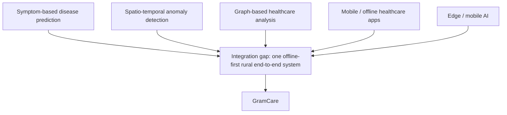

# GramCare — Literature Review

> **Project:** GramCare — AI-Powered Offline Disease Outbreak Monitoring System
> **Document:** Literature Review & Research Gap
> **Version:** 0.1 (Review 1 — Research & System Design)
> **Status:** Baseline — citations completed from the verified survey
> **Last updated:** 2026-08-22
> **Team:** M. Faizan Patel · Yasa Ghanchi · Niranjan Mohite · Yash S. Waghela
> **Guide / College:** *To be finalized*

---

> **Integrity note.** This document does not fabricate references. The survey is based on **8 verified IEEE papers**, and the citations below are the exact, verified bibliographic details (authors, title, venue, year, DOI) taken from the team's verification survey. Where a paper's full text was accessible, it was reviewed (Tier 1); where access was gated, that is stated plainly rather than implying a full review (Tier 2). No placeholder has been filled with an unverified reference, and no source was added to reach a paper-count target (D-009).

## 1. Survey approach

The objective of this survey is to establish what already exists across the capabilities GramCare combines, and thereby to define a defensible research gap. The team deliberately chose a smaller set of verified sources over an inflated list of unverifiable ones; a compact, honest, and verifiable foundation is more defensible in review than a padded bibliography. The corresponding decision is recorded as D-009 in `DECISIONS.md`.

## 2. Research areas covered

The eight papers span the capability areas that GramCare draws together: disease prediction; symptom classification; disease-outbreak detection; spatio-temporal analysis; mobile and rural healthcare; offline healthcare; graph-based healthcare; and edge / mobile AI.

## 3. Access tiers

To be transparent about depth of review, the papers are grouped into two tiers. **Tier 1** consists of five papers whose full text was accessible and which were reviewed in full. **Tier 2** consists of three verified IEEE papers whose full text was access-gated; these are included because they are relevant and verifiable, but they were not read in full, and this document says so rather than pretending otherwise.

## 4. Paper register

The register below lists the exact verified citation for each paper. Tiers reflect the 5 + 3 split described above: Tier 1 papers were reviewed in full; Tier 2 papers are verified IEEE papers whose full text was access-gated and were therefore analysed at abstract/metadata level only.

| # | Citation (authors, title, venue, year, DOI) | Research area | Tier | Access | Key relevance to GramCare |
|---|-----------------------------------------------|---------------|------|--------|---------------------------|
| 1 | M. A. Hossain, A. K. M. M. Islam, S. Islam, S. Shatabda, and A. Ahmed, "Symptom Based Explainable Artificial Intelligence Model for Leukemia Detection," *IEEE Access*, vol. 10, pp. 57283–57298, 2022, doi: 10.1109/ACCESS.2022.3176274. | Symptom-based disease prediction; explainable AI | 1 | Full text reviewed | Template for patient-level symptom → *possible condition* prediction that surfaces *why* a condition was flagged, not a black-box label. |
| 2 | P. Chittora, S. Chaurasia, P. Chakrabarti, G. Kumawat, T. Chakrabarti, *et al.*, "Prediction of Chronic Kidney Disease – A Machine Learning Perspective," *IEEE Access*, vol. 9, pp. 17312–17334, 2021, doi: 10.1109/ACCESS.2021.3053763. | Classical ML disease classification on a small structured dataset | 1 | Full text reviewed | Methodological template for a small-dataset classifier comparison (SVM/KNN/ANN); cautions on small-N generalisation (UCI CKD, 400 records). |
| 3 | Y. Karadayı, M. N. Aydın, and A. S. Öğrenci, "Unsupervised Anomaly Detection in Multivariate Spatio-Temporal Data Using Deep Learning: Early Detection of COVID-19 Outbreak in Italy," *IEEE Access*, vol. 8, pp. 164155–164177, 2020, doi: 10.1109/ACCESS.2020.3022366. | Spatio-temporal outbreak / anomaly detection | 1 | Full text reviewed | Closest match to community-level *potential-outbreak* detection; unsupervised, no labelled outbreak data required — GramCare adopts the idea in a much lighter form. |
| 4 | M. A. Khatun, M. A. Yousuf, S. Ahmed, M. Z. Uddin, S. A. Alyami, *et al.*, "Deep CNN-LSTM With Self-Attention Model for Human Activity Recognition Using Wearable Sensor," *IEEE J. Transl. Eng. Health Med.*, vol. 10, art. 2700316, 2022, doi: 10.1109/JTEHM.2022.3177710. | Edge / on-device (smartphone-sensor) deep learning | 1 | Full text reviewed | Architectural reference for smartphone-only health ML pipelines; supports mobile feasibility, though GramCare prefers lighter classical ML for on-device use. |
| 5 | X. Chai, "Diagnosis Method of Thyroid Disease Combining Knowledge Graph and Deep Learning," *IEEE Access*, vol. 8, pp. 149787–149795, 2020, doi: 10.1109/ACCESS.2020.3016676. | Graph-based healthcare (knowledge graph + deep learning) | 1 | Full text reviewed | Evidence for *evaluating* (not assuming) a graph layer: graphs add value but need a sizeable structured corpus (supports D-005). |
| 6 | Z. Sun, H. Yin, H. Chen, T. Chen, L. Cui, and F. Yang, "Disease Prediction via Graph Neural Networks," *IEEE J. Biomed. Health Inform.*, vol. 25, no. 3, pp. 818–826, 2021, doi: 10.1109/JBHI.2020.3004143. | Graph-based healthcare (graph neural networks) | 2 | Verified; access-gated | Conceptual precedent for graph-based prediction on sparse labelled data; analysed at abstract level only. |
| 7 | Dasgupta, Ghosh, and Mitra, "A Mobile Volunteered Geographic Information Management Platform for Rural Health Informatics," in *Proc. 2015 17th IEEE Int. Conf. E-health Networking, Application and Services (HealthCom)*, 2015, pp. 381–384, doi: 10.1109/HealthCom.2015.7454530. | Mobile / rural health + geographic data collection | 2 | Verified; access-gated | Closest precedent for offline, geo-tagged health-worker data collection; a mapping/collection layer with no AI analysis per its abstract. |
| 8 | A. F. C. Garces and J. P. O. Lojo, "Developing an Offline Mobile Application with Health Condition Care and First Aid Instruction for Appropriateness of Medical Treatment," in *Proc. 2019 IEEE Integrated STEM Education Conf. (ISEC)*, 2019, pp. 13–14, doi: 10.1109/ISECon.2019.8882013. | Mobile / rural / offline healthcare | 2 | Verified; access-gated | Validates the offline-first premise in low-resource settings; delivers static information only, not symptom classification or outbreak detection. |

*Confidence note: papers 7 and 8 have thinner independent corroboration than papers 1–6 (each confirmed by a single independent secondary citation). Their DOI/venue/page data is internally consistent across every source found; treat them as verified but slightly less robust.*

### 4.1 Comparative analysis — what each paper provides vs. what GramCare proposes

The table below maps each verified paper against GramCare's problem. The GramCare column describes **proposed** capabilities only — none are implemented yet — consistent with the integration framing in D-010.

| Paper | What the paper provides | Limitation / gap | What GramCare proposes |
|-------|-------------------------|------------------|------------------------|
| [1] Leukemia Symptom XAI (2022) | Symptom-only disease prediction for a single condition, with an explainability layer showing which symptoms drove the prediction | Limited to one disease and hospital-sourced data; not designed for offline/mobile field use; no community-level aggregation | Apply a similar symptom-based, explainable prediction approach in an offline-first field tool, then feed individual predictions into community-level case aggregation |
| [2] CKD Prediction — ML comparison (2021) | Comparative benchmarking of classifiers (SVM, KNN, ANN) with feature selection on a small (400-record) structured dataset | Individual-patient prediction only; no field collection, mobile deployment, or outbreak-level analysis | Reuse a similar small-dataset classification methodology, then extend the output beyond individual prediction into aggregated village-level pattern analysis |
| [3] Spatio-temporal anomaly detection — COVID-19 Italy (2020) | Unsupervised anomaly detection identifying abnormal case patterns across regions and time, without labelled outbreak data | Relies on centralised, already-collected regional data; rural health-worker collection and offline operation are not addressed | Combine offline, field-level data collection with a simplified temporal + geographic analysis to flag potential outbreak patterns across villages |
| [4] CNN-LSTM-Attention for HAR (2022) | A mobile-sensor-compatible deep learning architecture (accelerometer/gyroscope), not applied to disease or symptoms | Not applied to disease prediction; on-device/offline inference performance is not benchmarked | Prefer a lighter, classical-ML symptom classifier chosen specifically for feasible on-device/offline use within FYP constraints |
| [5] Thyroid diagnosis via knowledge graph + DL (2020) | Demonstrates that a medical knowledge graph combined with deep learning improves diagnostic accuracy for one disease | Patient-level only; requires a sizeable structured EMR corpus to build the graph | Treat graph analysis as an optional, evaluated relationship layer — added only if it proves worth the cost for a synthetic-data FYP |
| [6] Disease Prediction via GNN (2021) *(Tier 2)* | Per abstract, a GNN augmenting sparse EMR labels with an external knowledge base for disease prediction | Patient-level only per abstract; full methodology and dataset scale not independently verifiable | Consider graph methods only as an optional layer, prioritising a lighter classical-ML pipeline for the MVP given the unverified implementation cost |
| [7] Mobile VGI for rural health informatics (2015) *(Tier 2)* | Mobile, geo-tagged health data collection by field workers in rural settings, producing a regional "health map" | Per abstract, no AI-based symptom analysis or outbreak detection — a collection/mapping layer only | Combine mobile/offline field collection with AI-based symptom analysis and potential-outbreak monitoring, extending beyond mapping alone |
| [8] Offline mobile health & first-aid app (2019) *(Tier 2)* | Offline delivery of health-condition and first-aid information to a low-resource community in a local language | Static informational content only; no AI prediction or community-level surveillance reported | Extend the offline-delivery concept into a full pipeline: collection + AI symptom analysis + synchronisation + community-level outbreak awareness |

## 5. Main findings

Across the reviewed literature, the individual capabilities GramCare relies on already exist and are, in isolation, well studied. Symptom-based disease prediction and machine-learning disease classification are established, and explainable-AI techniques exist to make such predictions interpretable. Spatio-temporal anomaly detection provides methods for identifying unusual increases across time and space. Mobile and rural health systems, and offline healthcare applications, demonstrate that field data collection under poor connectivity is feasible. Geographic health information, knowledge graphs, and graph neural networks show that health relationships can be modelled and analysed. Mobile and edge AI show that models can run on constrained devices.

The consistent picture is that the building blocks are mature individually, but they are typically studied and deployed *separately*.

## 6. Research gap

The reviewed IEEE literature demonstrates approaches for symptom-based disease prediction, spatio-temporal anomaly detection, graph-based healthcare analysis, and mobile/offline healthcare applications, but shows limited integration of offline-first rural health-worker data collection with AI-assisted symptom analysis and subsequent temporal and geographic community-level disease-pattern monitoring in a single end-to-end system.

In other words, the gap is one of **integration**, not invention. The claim is not that these problems are unsolved individually, but that their combination into one offline-first rural workflow is under-addressed.

## 7. Proposed contribution

GramCare's contribution is primarily integrative: it combines offline field collection, AI-assisted symptom analysis, synchronization, community-level analysis, temporal monitoring, geographic monitoring, and potential-outbreak awareness into a single workflow suited to rural and low-connectivity settings. The project does not claim that the individual algorithms are novel; it claims that assembling them into one coherent, offline-first, end-to-end system for rural disease surveillance is the contribution. This framing is recorded as D-010 in `DECISIONS.md`.

---

### Related documents

- [Project Overview](./PROJECT_OVERVIEW.md)
- [MVP Scope](./MVP_SCOPE.md)
- [Architecture](./ARCHITECTURE.md)
- [AI Requirements](./AI_REQUIREMENTS.md)
- [Requirements Specification](./REQUIREMENTS.md)
- [Data Model](./DATA_MODEL.md)
- [AI Methodology](./AI_METHODOLOGY.md)
- [Dataset Strategy](./DATASET_STRATEGY.md)
- [Demo Scenario](./DEMO_SCENARIO.md)
- [Testing Strategy](./TESTING_STRATEGY.md)
- [Decisions Log](./DECISIONS.md)
- [Literature Review](./LITERATURE_REVIEW.md) *(this document)*
