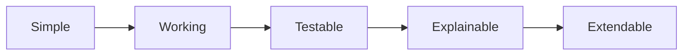

# GramCare — MVP Scope

> **Project:** GramCare — AI-Powered Offline Disease Outbreak Monitoring System
> **Document:** MVP Scope, Anti-Scope, and Demonstration Plan
> **Version:** 0.1 (Review 1 — Research & System Design)
> **Status:** Baseline
> **Last updated:** 2026-08-22
> **Team:** M. Faizan Patel · Yasa Ghanchi · Niranjan Mohite · Yash S. Waghela
> **Guide / College:** *To be finalized*

---

## 1. Scope intent

GramCare is a final-year project to be delivered in roughly three to four months. The scope below is chosen so that the project can be built, tested, explained, and demonstrated within that window while still demonstrating the full end-to-end concept. The guiding rule is that every feature must be justified by the project objective; features that merely look impressive are out of scope.

## 2. Must-have (MVP)

The minimum viable product must include the following, which together demonstrate the complete flow from field collection to a potential outbreak alert:

- a health-worker mobile interface;
- patient registration;
- symptom recording;
- offline storage;
- synchronization;
- AI-assisted symptom classification;
- basic disease-pattern analysis;
- time-based analysis;
- location-based analysis;
- simple case-cluster detection;
- a monitoring dashboard;
- potential outbreak alerts;
- synthetic / demo data to drive the demonstration.

## 3. Anti-scope (deliberately excluded)

To protect the timeline, GramCare will **not** attempt to become any of the following. These are recorded explicitly so that scope creep can be recognised and declined:

- a national healthcare system;
- a complete hospital management system;
- a telemedicine platform;
- a full clinical diagnosis system;
- a large-scale epidemiological platform;
- an enterprise SaaS platform.

## 4. Future scope

The following are legitimate future enhancements and should be presented as such — not as current MVP functionality: advanced disease prediction; support for more diseases; multilingual support; advanced outbreak forecasting; vaccination monitoring; telemedicine; wearable-device integration; government healthcare integration; large-scale regional deployment; advanced graph analytics; and more sophisticated epidemiological models.

## 5. Data strategy for the prototype

For the college prototype the system uses **synthetic / demo data**. This allows realistic scenarios to be simulated safely — for example, several villages reporting normal case numbers while one village shows a sudden increase — so that the system's pattern-detection behaviour can be demonstrated. Real patient information will not be used in the development or demonstration system without an appropriate process and approvals.

## 6. Demonstration scenario

A strong end-to-end demonstration proceeds in stages. During a **normal period**, several villages report small numbers of cases. A **simulated increase** then begins in one village, which starts reporting many similar symptoms. A **spread pattern** follows as nearby villages begin reporting similar cases. GramCare's analysis observes the increasing case count, the similar symptoms, and the geographic and temporal proximity, and the dashboard highlights the affected area. A **potential outbreak alert** is then generated, and authorities investigate the pattern.

A representative synthetic pattern for the demonstration:

| Village | Pattern |
|---------|---------|
| Village A | Normal |
| Village B | Normal |
| Village C | Sudden increase |
| Village D | Similar symptoms |

This is a demonstration scenario designed to exercise the system's logic; it is not a claim of real-world outbreak prediction.

## 7. Development philosophy

The project deliberately follows a build order of **Simple → Working → Testable → Explainable → Extendable**, rather than pursuing complex, impressive-looking designs that are difficult to finish.

A working, explainable system that covers the full flow is more valuable for this project than a partially-finished complex one. This philosophy also governs technology and model selection, described in `DECISIONS.md` and `AI_REQUIREMENTS.md`.

---

### Related documents

- [Project Overview](./PROJECT_OVERVIEW.md)
- [MVP Scope](./MVP_SCOPE.md) *(this document)*
- [Architecture](./ARCHITECTURE.md)
- [AI Requirements](./AI_REQUIREMENTS.md)
- [Requirements Specification](./REQUIREMENTS.md)
- [Data Model](./DATA_MODEL.md)
- [AI Methodology](./AI_METHODOLOGY.md)
- [Dataset Strategy](./DATASET_STRATEGY.md)
- [Demo Scenario](./DEMO_SCENARIO.md)
- [Testing Strategy](./TESTING_STRATEGY.md)
- [Decisions Log](./DECISIONS.md)
- [Literature Review](./LITERATURE_REVIEW.md)
