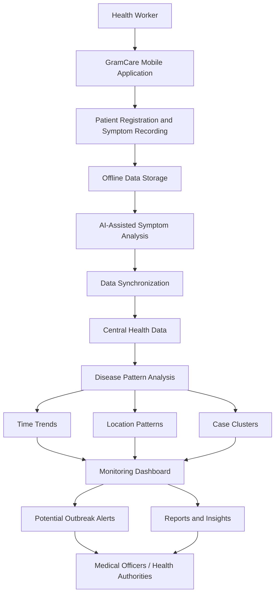
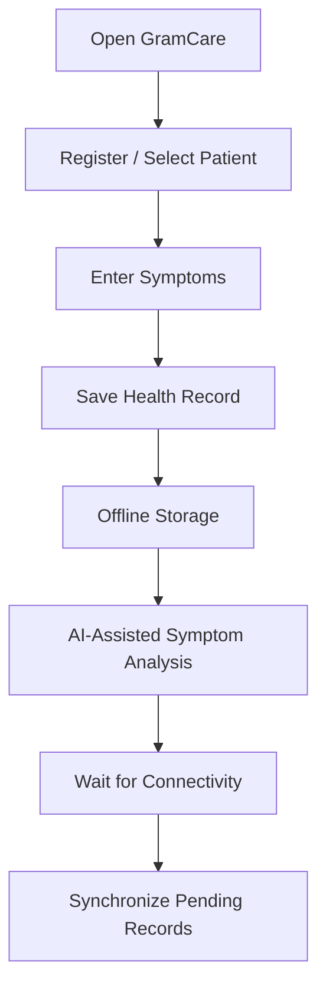

# GramCare — Project Overview

> **Project:** GramCare — AI-Powered Offline Disease Outbreak Monitoring System
> **Document:** Project Overview
> **Version:** 0.1 (Review 1 — Research & System Design)
> **Status:** Baseline / source of truth
> **Last updated:** 2026-08-22
> **Team:** M. Faizan Patel · Yasa Ghanchi · Niranjan Mohite · Yash S. Waghela
> **Guide / College:** *To be finalized*

---

## 1. Purpose of this document

This document is the authoritative description of what GramCare is, the problem it addresses, and the end-to-end concept the team has agreed upon. It is written to be read by the project team, the project guide, and the review panel. Companion documents cover scope, architecture, AI requirements, engineering decisions, and the literature foundation; links appear at the end of this document. The core idea recorded here should not be altered without an explicit, recorded decision in `DECISIONS.md`.

## 2. The project in one paragraph

GramCare is an offline-first healthcare monitoring system for rural and low-connectivity communities. A health worker can register a patient and record symptoms on a mobile application even when there is no internet connection. Records are stored locally and synchronized to a central store when connectivity returns. AI assists the health worker with symptom analysis at the point of care, while the aggregated data from many locations is analyzed for time-based trends, geographic patterns, and clusters of similar cases. The results are presented on a monitoring dashboard, where an unusual pattern can generate a *potential outbreak alert* for medical officers and health authorities to investigate. The system converts individual patient records into community-level health intelligence, moving rural disease monitoring from delayed, fragmented reporting toward continuous, data-driven surveillance.

## 3. System at a glance

The complete flow, from a single field observation to a public-health decision, is shown below.

In one line: **Collect → Store Offline → Analyze → Synchronize → Detect Patterns → Visualize → Alert.**

## 4. The problem

Rural and remote healthcare faces several connected problems that GramCare is designed to address together rather than in isolation.

The first is **connectivity**. Health workers frequently operate in areas where internet access is unreliable or unavailable, which makes continuously-online healthcare applications impractical for day-to-day fieldwork.

The second is **data fragmentation**. Health information is often paper-based, digitally isolated, recorded separately by different workers, or confined to a single village or health centre, so it is difficult to combine into a shared picture.

The third is **delayed disease monitoring**. When cases are recorded independently, it is hard to notice that similar symptoms or diseases are rising across neighbouring communities until the pattern is already advanced.

The fourth is **limited community-level visibility**. A health worker may understand what is happening in their own area but has little insight into patterns forming across multiple locations.

The fifth is **manual analysis**. Identifying trends, clusters, and unusual increases by hand is slow and does not scale as the number of records grows.

## 5. Vision

The vision behind GramCare is to move rural disease monitoring away from delayed and fragmented reporting and toward continuous, data-driven, and proactive surveillance. Concretely, the system aims to transform individual patient records into community-level health intelligence that authorities can act on.

## 6. Proposed solution

GramCare proposes an offline-first mobile healthcare application supported by a central analysis layer. In the field, a health worker registers a patient, records symptoms and health information, continues working without internet access, and stores information locally. AI assists with symptom analysis at the point of care, and records synchronize to the central store when connectivity returns.

Once records from multiple locations are available centrally, the system analyzes them for time-based trends, geographic patterns, and clusters of similar cases, and it surfaces the results through a monitoring dashboard. When a significant abnormal pattern is identified, GramCare generates a potential outbreak alert for medical officers or health authorities to investigate. The alert is an invitation to investigate, not a confirmation of an outbreak.

## 7. Health-worker workflow

The field-level workflow is deliberately simple, and its defining principle is that a lack of internet connectivity must never stop basic data collection.

## 8. Community-level analysis

Once records from multiple locations are available, GramCare moves beyond the individual patient and analyzes three dimensions of the aggregated data.

**Time trends** look at how case counts change over successive periods. A sudden increase may represent an unusual pattern worth investigating:

| Period | Cases |
|--------|-------|
| Week 1 | 5 |
| Week 2 | 7 |
| Week 3 | 15 |

**Location patterns** compare case activity across areas so that a location with unusually high activity stands out:

| Location | Cases |
|----------|-------|
| Village A | 3 |
| Village B | 4 |
| Village C | 18 |

**Case clusters** are identified when multiple nearby cases share similar symptoms, fall within a similar time period, and occur in a similar geographic area. Together these three dimensions form the basis for identifying a potential outbreak pattern, described in `AI_REQUIREMENTS.md`.

## 9. Target users

GramCare serves two primary user groups with distinct responsibilities.

**Health workers** operate at the field level. They register patients, record symptoms, manage field records, work offline, and synchronize records when connectivity is available.

**Medical officers and health authorities** operate at the oversight level. They monitor trends, review cases, view geographic patterns, review potential alerts, generate and use reports, and — importantly — make the actual public-health decisions. GramCare supports these decisions; it does not make them.

## 10. Expected outputs

The system is expected to produce digital patient records, AI-assisted symptom indications, synchronized health data, disease trends, area-level case summaries, potential hotspots, case clusters, potential outbreak alerts, and supporting reports and insights.

## 11. Scope boundary

GramCare is intended for a final-year project timeline and is scoped accordingly. It is not a national healthcare system, a hospital management system, a telemedicine platform, a full clinical diagnosis system, or an enterprise platform. The detailed feature scope, anti-scope, and demonstration plan are defined in `MVP_SCOPE.md`.

---

### Related documents

- [Project Overview](./PROJECT_OVERVIEW.md) *(this document)*
- [MVP Scope](./MVP_SCOPE.md)
- [Architecture](./ARCHITECTURE.md)
- [AI Requirements](./AI_REQUIREMENTS.md)
- [Requirements Specification](./REQUIREMENTS.md)
- [Data Model](./DATA_MODEL.md)
- [AI Methodology](./AI_METHODOLOGY.md)
- [Dataset Strategy](./DATASET_STRATEGY.md)
- [Demo Scenario](./DEMO_SCENARIO.md)
- [Testing Strategy](./TESTING_STRATEGY.md)
- [Decisions Log](./DECISIONS.md)
- [Literature Review](./LITERATURE_REVIEW.md)
