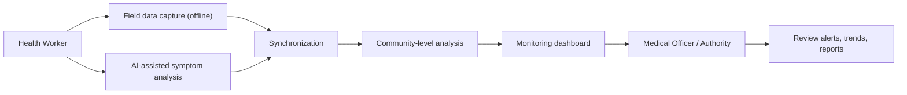

# GramCare — Requirements Specification

> **Project:** GramCare — AI-Powered Offline Disease Outbreak Monitoring System
> **Document:** Requirements Specification (Functional & Non-Functional)
> **Version:** 0.1 (Review 1 — Research & System Design)
> **Status:** Baseline
> **Last updated:** 2026-08-22
> **Team:** M. Faizan Patel · Yasa Ghanchi · Niranjan Mohite · Yash S. Waghela
> **Guide / College:** *To be finalized*

---

## 1. Purpose and scope

This document specifies **what** GramCare must do, not **how** it will be built. It translates the concept in `PROJECT_OVERVIEW.md` and the boundaries in `MVP_SCOPE.md` into numbered, checkable requirements that later drive `AI_METHODOLOGY.md`, `DATA_MODEL.md`, `DEMO_SCENARIO.md`, and `TESTING_STRATEGY.md`. Requirements are deliberately technology-neutral, consistent with decision D-001; the corresponding technology choices remain open items (O-01…O-11) in `DECISIONS.md`.

## 2. How to read this document

Each requirement has a stable identifier so it can be traced through design and testing. Functional requirements are grouped by actor (`FR-HW`, `FR-AI`, `FR-CA`, `FR-DB`, `FR-AU`); non-functional requirements use `NFR`. Priority uses MoSCoW, aligned to the MVP scope: **Must** items are the MVP must-haves in `MVP_SCOPE.md`; **Should** and **Could** items are desirable but may slip; **Won't (this release)** records deliberate exclusions. A requirement states an observable capability or quality; the mechanism that satisfies it is an implementation decision (see §6).

## 3. Functional requirements

### 3.1 Health worker

| ID | Requirement | Priority |
|----|-------------|----------|
| FR-HW-01 | The health worker can register a new patient, capturing at least a pseudonymous identifier, age, gender, and a location reference. | Must |
| FR-HW-02 | The health worker can retrieve and update an existing patient's details and correct data-entry errors. | Must |
| FR-HW-03 | The health worker can record a health encounter for a patient, entering one or more symptoms and the visit date. | Must |
| FR-HW-04 | All of the above (register, update, record) function fully while the device has no network connectivity. | Must |
| FR-HW-05 | The health worker can browse and search records stored locally on the device without connectivity. | Must |
| FR-HW-06 | Locally-held records marked pending are synchronized to the central store when connectivity is available; sync status is visible to the worker. | Must |
| FR-HW-07 | The health worker can view the AI-assisted symptom-analysis result for an encounter at the point of care. | Must |

### 3.2 AI (patient-level, decision support)

| ID | Requirement | Priority |
|----|-------------|----------|
| FR-AI-01 | Given the recorded symptoms (and relevant basic patient attributes), the system produces one or more *possible conditions*. | Must |
| FR-AI-02 | Each possible condition is accompanied by a confidence or ranking so results can be prioritised. | Must |
| FR-AI-03 | The system surfaces an understandable reason for a suggestion (e.g., the symptoms that most influenced it) rather than an opaque label. | Must |
| FR-AI-04 | Every AI output is presented as a *possible condition for professional judgement*, never as a definitive diagnosis. | Must |
| FR-AI-05 | Patient-level AI inference is available on-device so it works offline. | Must |

### 3.3 Community-level analysis

| ID | Requirement | Priority |
|----|-------------|----------|
| FR-CA-01 | The system aggregates synchronized encounters into cases keyed by location and time. | Must |
| FR-CA-02 | The system computes case-count trends over successive time periods (time-based analysis). | Must |
| FR-CA-03 | The system summarises case activity by location (location-based analysis). | Must |
| FR-CA-04 | The system groups similar nearby cases into candidate clusters by symptom similarity, time window, and geographic proximity. | Must |
| FR-CA-05 | The system flags a *potential outbreak pattern* when the combination of rising counts, similar symptoms, and spatial/temporal proximity crosses a defined sensitivity. | Must |
| FR-CA-06 | Each potential-outbreak flag carries the supporting evidence (contributing cases, location(s), time window) used to raise it. | Must |

### 3.4 Dashboard (medical officer / authority view)

| ID | Requirement | Priority |
|----|-------------|----------|
| FR-DB-01 | The dashboard shows a case overview (totals and recent activity). | Must |
| FR-DB-02 | The dashboard shows disease/symptom trends over time. | Must |
| FR-DB-03 | The dashboard shows a location overview (cases by village/area). | Must |
| FR-DB-04 | The dashboard highlights potential hotspots (locations with unusual concentrations). | Must |
| FR-DB-05 | The dashboard lists potential outbreak alerts with their supporting evidence. | Must |
| FR-DB-06 | The dashboard can produce summary reports (counts and statistics) for a selected area and period. | Should |

### 3.5 Authority (oversight and decision-making)

| ID | Requirement | Priority |
|----|-------------|----------|
| FR-AU-01 | A medical officer can review each potential outbreak alert and its supporting evidence. | Must |
| FR-AU-02 | A medical officer can review generated reports. | Must |
| FR-AU-03 | A medical officer can review trends and location patterns. | Must |
| FR-AU-04 | The system supports (does not replace) the officer's decision by presenting the evidence needed to decide whether to investigate; the decision and any action remain human. | Must |
| FR-AU-05 | An alert can be annotated or marked as reviewed/acknowledged for basic workflow tracking. | Could |

## 4. Non-functional requirements

| ID | Quality | Requirement (target) |
|----|---------|----------------------|
| NFR-01 | Offline availability | Core field functions (FR-HW-01…05, FR-AI-01…05) operate with zero connectivity for an entire working session; no field feature may hard-depend on the network. |
| NFR-02 | Reliability | No loss of a saved local record across app restarts or unexpected shutdown; interrupted synchronization resumes without duplicating or dropping records. |
| NFR-03 | Data consistency | After successful synchronization, a record's central representation matches its local source; sync status accurately reflects state (pending/synced/failed). |
| NFR-04 | Security | Local data and data in transit are protected by access control and encryption appropriate to a prototype; no credentials or secrets are stored in clear text. |
| NFR-05 | Privacy | Patients are identified pseudonymously; the prototype uses only synthetic/demo data (D-008); no real personal health information is collected or stored. |
| NFR-06 | Usability | A health worker can complete register → record symptoms → view result with minimal training; the field flow favours few steps and tolerant input. |
| NFR-07 | Explainability | AI outputs (patient-level suggestions and community-level flags) are accompanied by human-readable reasons, consistent with FR-AI-03 and FR-CA-06. |
| NFR-08 | Maintainability | The system is modular so the AI model, the detection rule, and the storage layer can each be replaced without rewriting the others (supports the open decisions). |
| NFR-09 | Scalability (considerations) | The design should not preclude growth from demo scale (tens–hundreds of records, 3–5 villages) to larger datasets; large-scale deployment is explicitly future scope, not an MVP target. |
| NFR-10 | Performance | On a typical target device, patient-level AI inference returns within a couple of seconds; dashboard views over the demo dataset render promptly. Figures are provisional demo targets, to be confirmed in testing. |
| NFR-11 | Data integrity | Records carry timestamps and identifiers; synchronization preserves them; a defined conflict-resolution rule prevents silent overwrite (rule choice is open — O-07). |

## 5. Assumptions and constraints

GramCare is a final-year project constrained to roughly 3–4 months (`MVP_SCOPE.md`), demonstrated on synthetic data, and operated by two user groups (health workers and medical officers). It assumes intermittent — not permanent — connectivity for synchronization, and modest data volumes at demo scale. These constraints shape the non-functional targets above and the model choices explored in `AI_METHODOLOGY.md`.

## 6. Requirements vs implementation decisions

The requirements above say *what* and *how well*; they intentionally do not name a language, framework, database, cloud, GIS, model, or sync technology. Those are open decisions and must not be presented as chosen. Examples of the boundary:

| Requirement (this document) | Corresponding open implementation decision (`DECISIONS.md`) |
|------------------------------|-------------------------------------------------------------|
| NFR-01 offline availability | O-01 app framework, O-02 local database |
| FR-CA-05 potential-outbreak detection | O-09 detection algorithm (kept simple per D-006) |
| FR-AI-01…03 symptom analysis + explainability | O-04 AI model (see candidate comparison in `AI_METHODOLOGY.md`) |
| FR-HW-06 / NFR-03 synchronization & consistency | O-07 sync technology and conflict-resolution strategy |
| FR-DB-03 / FR-DB-04 location views & hotspots | O-06 GIS/mapping technology |
| FR-CA-04 clustering (graph optional) | O-08 graph database/algorithm (only if D-005 evaluation is positive) |

Meeting a requirement never requires a specific product; where several approaches could satisfy it, the trade-offs are analysed (for AI, in `AI_METHODOLOGY.md`) and the decision is deferred until evidence supports one.

---

### Related documents

- [Project Overview](./PROJECT_OVERVIEW.md)
- [MVP Scope](./MVP_SCOPE.md)
- [Architecture](./ARCHITECTURE.md)
- [AI Requirements](./AI_REQUIREMENTS.md)
- [Requirements Specification](./REQUIREMENTS.md) *(this document)*
- [Data Model](./DATA_MODEL.md)
- [AI Methodology](./AI_METHODOLOGY.md)
- [Dataset Strategy](./DATASET_STRATEGY.md)
- [Demo Scenario](./DEMO_SCENARIO.md)
- [Testing Strategy](./TESTING_STRATEGY.md)
- [Decisions Log](./DECISIONS.md)
- [Literature Review](./LITERATURE_REVIEW.md)
